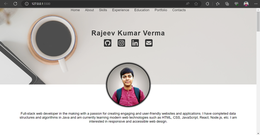

# Personal Portfolio
This project is a personal portfolio website created as a web development project. It showcases your skills, experience, education, and contact information in an organized and visually appealing manner.

## Technologies Used
- HTML
- CSS
- JavaScript

## Installation
1. Clone the repository:
2. Navigate to the project directory.
3. Open the `index.html` file in a web browser.

## Usage
- Update the HTML and CSS files to customize the content and design of your personal portfolio.
- Add your own profile photo, information, experience, education, skills, and contact details.
- Customize the styles in the CSS file to match your desired design.
- Replace the placeholder images with your own images.
- Modify the JavaScript code to add any additional functionality or customization you require.

## Screenshots
